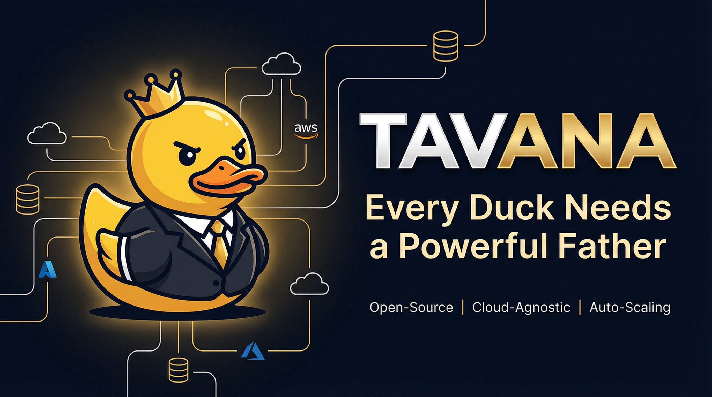

# Tavana

<p align="center">
  
</p>

**The open-source alternative to MotherDuck** — because every duck needs a powerful father.

Cloud-agnostic, auto-scaling SQL query engine for data lakes. Query Delta Lake, Parquet, and Iceberg data through PostgreSQL-compatible clients or Arrow Flight SQL. Deploy on your own infrastructure, keep full control of your data.

## Architecture

```
┌─────────────────┐     ┌─────────────────┐
│     Clients     │     │     Clients     │
│  (psql, Tableau │     │  (Python ADBC,  │
│   DBeaver, etc) │     │   Arrow Flight) │
└────────┬────────┘     └────────┬────────┘
         │ PostgreSQL            │ gRPC
         │ Wire Protocol         │ Flight SQL
         └──────────┬────────────┘
                    ▼
           ┌────────────────┐
           │    Gateway     │
           │  (Query Queue, │
           │   Routing, HPA)│
           └────────┬───────┘
                    │ gRPC
        ┌───────────┼───────────┐
        ▼           ▼           ▼
   ┌─────────┐ ┌─────────┐ ┌─────────┐
   │ Worker  │ │ Worker  │ │ Worker  │
   │ (DuckDB)│ │ (DuckDB)│ │ (DuckDB)│
   └─────────┘ └─────────┘ └─────────┘
        │           │           │
        └───────────┼───────────┘
                    ▼
           ┌────────────────┐
           │  Cloud Storage │
           │ (S3/ADLS/GCS)  │
           └────────────────┘
```

The gateway accepts connections, queues and routes queries, and manages auto-scaling. Workers run DuckDB and stream results back. Everything scales horizontally via HPA and vertically via in-place memory resizing.

## Installation

### Docker

```bash
docker network create tavana-network

docker run -d --name tavana-worker --network tavana-network \
  -p 50053:50053 -e GRPC_PORT=50053 -e MAX_MEMORY_GB=4 \
  angelerator/tavana-worker:latest

docker run -d --name tavana-gateway --network tavana-network \
  -p 5432:15432 -p 8080:8080 \
  -e PG_PORT=15432 -e WORKER_ADDR=http://tavana-worker:50053 \
  angelerator/tavana-gateway:latest
```

### Docker Compose

```yaml
services:
  worker:
    image: angelerator/tavana-worker:latest
    ports: ["50053:50053"]
    environment:
      GRPC_PORT: 50053
      MAX_MEMORY_GB: 4

  gateway:
    image: angelerator/tavana-gateway:latest
    ports: ["5432:15432", "8080:8080"]
    environment:
      PG_PORT: 15432
      WORKER_ADDR: http://worker:50053
    depends_on: [worker]
```

```bash
docker compose up -d
```

### Kubernetes (Helm)

```bash
# From OCI registry
helm install tavana oci://ghcr.io/angelerator/charts/tavana \
  -n tavana --create-namespace

# Or from source
git clone https://github.com/Angelerator/Tavana.git
helm install tavana ./Tavana/helm/tavana -n tavana --create-namespace
```

Port-forward to test:

```bash
kubectl port-forward -n tavana svc/gateway 5432:5432 &
psql -h localhost -p 5432 -U tavana -c "SELECT 1"
```

### Building from Source

Requires Rust 1.80+ and `protoc`:

```bash
git clone https://github.com/Angelerator/Tavana.git
cd Tavana
cargo build --release
```

Binaries are at `target/release/tavana-gateway` and `target/release/tavana-worker`.

## Usage

Connect with any PostgreSQL client:

```bash
psql -h localhost -p 5432 -U tavana
```

```sql
-- Delta Lake
SELECT * FROM delta_scan('s3://bucket/table/') LIMIT 100;

-- Parquet
SELECT * FROM read_parquet('s3://bucket/data/*.parquet');

-- CSV
SELECT * FROM read_csv('s3://bucket/data.csv');

-- Aggregations across cloud storage
SELECT category, SUM(amount)
FROM delta_scan('az://container/sales/')
GROUP BY category;
```

Arrow Flight SQL (for high-throughput workloads):

```python
import adbc_driver_flightsql.dbapi as adbc

with adbc.connect("grpc://localhost:443") as conn:
    with conn.cursor() as cur:
        cur.execute("SELECT * FROM delta_scan('s3://bucket/table')")
        table = cur.fetch_arrow_table()
```

## Credentials

Infrastructure-level credentials (env vars, Workload Identity) work out of the box. Users can override per-session:

```sql
SET s3_access_key_id = 'AKIA...';
SET s3_secret_access_key = '...';
SET s3_region = 'eu-west-1';

SELECT * FROM read_parquet('s3://my-bucket/data.parquet');
```

Session credentials are forwarded securely to workers and cleaned up automatically.

## Project Structure

```
tavana/
├── crates/
│   ├── tavana-gateway/     # Query routing, protocols, auto-scaling
│   ├── tavana-worker/      # DuckDB execution, streaming
│   └── tavana-common/      # Shared types, gRPC definitions
├── helm/tavana/            # Kubernetes Helm chart
├── proto/                  # gRPC protocol definitions
├── Dockerfile.gateway
└── Dockerfile.worker
```

## License

Apache 2.0
