# Tavana

**Cloud-Agnostic Auto-Scaling DuckDB Query Platform**

[](https://github.com/Angelerator/Tavana/releases)
[](https://hub.docker.com/r/angelerator/tavana-gateway)
[](https://opensource.org/licenses/Apache-2.0)

Tavana is a production-ready, auto-scaling SQL query engine for data lakes. It combines DuckDB's blazing-fast analytics performance with Kubernetes' orchestration capabilities to provide a serverless-like experience for querying petabytes of data stored in S3, Azure Data Lake, or Google Cloud Storage.

**Key Innovation:** Adaptive auto-scaling that combines both horizontal (more pods) and vertical (bigger pods) scaling, with intelligent query queuing that never rejects queries and proactively signals for capacity expansion.

---

## 🎯 What Problem Does Tavana Solve?

Traditional data lake query engines face a classic dilemma:

- **Over-provision resources** → Waste money on idle infrastructure
- **Under-provision resources** → Queries fail or timeout under load

**Tavana solves this with:**

1. **Adaptive Scaling**: Automatically scales workers based on actual query workload (not hardcoded thresholds)
2. **Smart Queuing**: FIFO queue that understands Kubernetes capacity and signals for scale-up proactively
3. **Resource Awareness**: Detects cluster limits and operates in two modes (Scaling vs Saturation)
4. **Zero Rejections**: Queries never get rejected; they wait in queue until resources are available

---

## ✨ Features

### Core Capabilities
- ✅ **PostgreSQL Wire Protocol** - Works with any PostgreSQL client (psql, DBeaver, Tableau, Python, JDBC)
- ✅ **SSL/TLS Support** - Optional encrypted connections with self-signed or custom certificates
- ✅ **DuckDB Engine** - 10-100x faster than traditional engines for analytical queries
- ✅ **S3-Compatible Storage** - Query Parquet/CSV/JSON files from S3, ADLS Gen2, GCS, MinIO
- ✅ **Delta Lake Support** - Native `delta_scan()` for Delta Lake tables with Azure Workload Identity
- ✅ **Streaming Results** - Memory-efficient row-by-row streaming for large result sets
- ✅ **True Streaming Cursors** - Server-side cursors with O(n) performance (no re-scanning on FETCH)

### Auto-Scaling
- ✅ **Horizontal Pod Autoscaler (HPA)** - Scales worker count from 1-20 based on queue depth and wait times
- ✅ **Vertical Pod Autoscaler (VPA)** - Dynamically resizes worker memory (512MB-12GB) based on query needs
- ✅ **Pre-Assignment Sizing** - Sizes workers BEFORE query execution to prevent OOM
- ✅ **Elastic Growth** - Grows worker memory DURING execution if utilization is high
- ✅ **Smart Shrink** - Reduces idle worker memory back to minimum

### Intelligent Queuing
- ✅ **FIFO Fairness** - First-in, first-out query execution
- ✅ **Capacity-Aware Admission** - Checks available memory across all workers
- ✅ **Proactive HPA Signaling** - Signals Kubernetes to add workers when queue grows
- ✅ **Resource Ceiling Detection** - Knows when cluster is at max capacity
- ✅ **Never Rejects** - Blocks caller until capacity is available (no 429 errors)

### Production-Grade
- ✅ **GitOps Ready** - Terraform + Helm + ArgoCD deployment
- ✅ **Multi-Cloud** - Azure, AWS, GCP, on-premise Kubernetes
- ✅ **Observable** - Prometheus metrics + Grafana dashboards
- ✅ **Secure** - Pod security policies, network policies, workload identity
- ✅ **CI/CD** - Automated builds, tests, security scans, image signing

---

## 🏗️ Architecture

### High-Level Overview

```
┌─────────────────────────────────────────────────────────────────────────────┐
│                              CLIENT LAYER                                    │
│   Tableau / PowerBI / DBeaver / psql / Python / JDBC (PostgreSQL Protocol)  │
└──────────────────────────────────┬──────────────────────────────────────────┘
                                   │ TCP 5432 (PostgreSQL Wire Protocol)
                                   ▼
┌─────────────────────────────────────────────────────────────────────────────┐
│                          KUBERNETES CLUSTER                                  │
│ ┌─────────────────────────────────────────────────────────────────────────┐ │
│ │                       TAVANA NAMESPACE                                   │ │
│ │                                                                          │ │
│ │  ┌────────────────────────────────────────────────────────────────────┐ │ │
│ │  │                   GATEWAY (2+ replicas, HA)                        │ │ │
│ │  │                                                                    │ │ │
│ │  │  ┌──────────────────┐  ┌──────────────────┐  ┌────────────────┐  │ │ │
│ │  │  │   PG Wire        │→ │   QueryQueue     │→ │  SmartScaler   │  │ │ │
│ │  │  │   Handler        │  │   (FIFO Queue)   │  │  (HPA + VPA)   │  │ │ │
│ │  │  │                  │  │                  │  │                │  │ │ │
│ │  │  │ • Auth           │  │ • Admission      │  │ • Scale workers│  │ │ │
│ │  │  │ • Parse SQL      │  │ • Capacity check │  │ • Resize memory│  │ │ │
│ │  │  │ • Route queries  │  │ • FIFO dispatch  │  │ • K8s API      │  │ │ │
│ │  │  └──────────────────┘  └──────────────────┘  └────────────────┘  │ │ │
│ │  │                                │                                   │ │ │
│ │  │                                │ gRPC (ExecuteQuery)               │ │ │
│ │  └────────────────────────────────┼───────────────────────────────────┘ │ │
│ │                                   │                                     │ │
│ │  ┌────────────────────────────────▼───────────────────────────────────┐ │ │
│ │  │              WORKERS (2-20 pods, auto-scaled by HPA)               │ │ │
│ │  │                                                                     │ │ │
│ │  │  ┌──────────────┐  ┌──────────────┐         ┌──────────────┐      │ │ │
│ │  │  │  Worker 1    │  │  Worker 2    │   ...   │  Worker N    │      │ │ │
│ │  │  │              │  │              │         │              │      │ │ │
│ │  │  │ • DuckDB     │  │ • DuckDB     │         │ • DuckDB     │      │ │ │
│ │  │  │ • S3 Reader  │  │ • S3 Reader  │         │ • S3 Reader  │      │ │ │
│ │  │  │ • Extensions │  │ • Extensions │         │ • Extensions │      │ │ │
│ │  │  │ • Streaming  │  │ • Streaming  │         │ • Streaming  │      │ │ │
│ │  │  │              │  │              │         │              │      │ │ │
│ │  │  │ Memory:      │  │ Memory:      │         │ Memory:      │      │ │ │
│ │  │  │ 512MB-12GB   │  │ 512MB-12GB   │         │ 512MB-12GB   │      │ │ │
│ │  │  └──────┬───────┘  └──────┬───────┘         └──────┬───────┘      │ │ │
│ │  │         │                  │                        │              │ │ │
│ │  └─────────┼──────────────────┼────────────────────────┼──────────────┘ │ │
│ │            │                  │                        │                │ │
│ └────────────┼──────────────────┼────────────────────────┼────────────────┘ │
│              │                  │                        │                  │
│              │  S3 API (HTTPS)  │                        │                  │
└──────────────┼──────────────────┼────────────────────────┼──────────────────┘
               │                  │                        │
               ▼                  ▼                        ▼
        ┌──────────────────────────────────────────────────────────┐
        │              OBJECT STORAGE (S3-compatible)              │
        │                                                           │
        │  AWS S3  /  Azure ADLS Gen2  /  Google GCS  /  MinIO    │
        │                                                           │
        │  • Parquet files                                         │
        │  • CSV files                                             │
        │  • JSON files                                            │
        └──────────────────────────────────────────────────────────┘
```

### Core Components

#### 1. **Gateway** (`tavana-gateway`)

The Gateway is the query entry point and orchestration layer.

**Responsibilities:**
- **PostgreSQL Wire Protocol**: Accepts connections from any PostgreSQL client
- **Query Routing**: Analyzes SQL and estimates resource requirements
- **Queue Management**: Manages the FIFO query queue with capacity awareness
- **Worker Pool**: Tracks worker availability and health
- **Auto-Scaling**: Triggers HPA (add workers) and VPA (resize workers)
- **Metrics & Observability**: Exposes Prometheus metrics

**Key Modules:**
- `pg_wire.rs`: PostgreSQL wire protocol implementation
- `cursors.rs`: Server-side cursor management (DECLARE/FETCH/CLOSE)
- `query_queue.rs`: Smart FIFO queue with capacity awareness
- `smart_scaler.rs`: HPA + VPA scaling logic
- `worker_pool.rs`: Worker discovery and load balancing
- `worker_client.rs`: gRPC client for worker communication (including cursor APIs)
- `data_sizer.rs`: Query cost estimation (S3 HEAD requests)

**Technology:**
- **Language**: Rust (for performance and safety)
- **Concurrency**: Tokio async runtime (handles thousands of concurrent connections)
- **Protocol**: PostgreSQL wire protocol v3.0
- **gRPC**: Communicates with workers via gRPC

#### 2. **Worker** (`tavana-worker`)

Workers execute DuckDB queries and stream results back to clients.

**Responsibilities:**
- **Query Execution**: Runs DuckDB queries on Parquet/CSV/JSON files
- **S3 Integration**: Reads data from object storage via DuckDB's httpfs extension
- **Result Streaming**: Streams results row-by-row to prevent memory exhaustion
- **Extension Management**: Pre-loads DuckDB extensions (httpfs, parquet)
- **Resource Reporting**: Reports memory/CPU usage to Gateway

**Key Features:**
- **In-Memory DuckDB**: Each worker runs an in-memory DuckDB instance
- **Extension Pre-Installation**: DuckDB extensions are pre-downloaded at build time
- **True Streaming Cursors**: Holds DuckDB Arrow iterators for server-side cursor support
- **Memory Safety**: Uses Rust's ownership model to prevent memory leaks
- **Graceful Shutdown**: Completes running queries before termination

**Technology:**
- **Language**: Rust with DuckDB C API bindings
- **Database**: DuckDB (in-memory, columnar, OLAP-optimized)
- **Storage**: Reads from S3 via DuckDB's httpfs extension
- **gRPC Server**: Receives query requests from Gateway
- **Cursor Manager**: Manages server-side cursors with idle cleanup

#### 3. **QueryQueue** (Inside Gateway)

The QueryQueue is the brain of admission control and capacity management.

**How It Works:**

1. **Query Arrives**: Client sends SQL via PostgreSQL protocol
2. **Cost Estimation**: Gateway estimates memory needed (via S3 HEAD requests on Parquet files)
3. **Capacity Check**: Check total available memory across all workers
   ```
   Available = Σ (worker.memory_limit - worker.memory_used)
   ```
4. **Admission Decision**:
   - **If capacity available** → Dispatch query immediately to a worker
   - **If no capacity**:
     - **Below resource ceiling** → Signal HPA to add workers, queue query
     - **At resource ceiling** → Queue query, return estimated wait time
5. **FIFO Dispatch**: As workers complete queries and free capacity, dispatch queued queries in order

**Key Behaviors:**
- **Never Rejects**: Queries wait in queue until capacity is available (no 429 errors)
- **Proactive Scaling**: Signals HPA when queue depth > 0 (don't wait for timeout)
- **Fair Scheduling**: First-in, first-out (no query starvation)
- **Capacity-Aware**: Understands total cluster capacity and current utilization

**Metrics Exposed:**
- `tavana_query_queue_depth`: Number of queries waiting
- `tavana_query_queue_wait_seconds`: Time queries wait before execution
- `tavana_available_capacity_mb`: Total unused memory across workers
- `tavana_resource_ceiling_mb`: Maximum available cluster memory
- `tavana_operation_mode`: Current mode (0=Scaling, 1=Saturation)

#### 4. **SmartScaler** (Inside Gateway)

The SmartScaler orchestrates both horizontal and vertical scaling.

**Horizontal Pod Autoscaler (HPA):**

Scales the number of worker pods based on:
- **Queue Depth**: If `queue_depth > 0`, scale up
- **Wait Time**: If `avg_wait_time > 30s`, scale up
- **Worker Utilization**: If `cpu > 70%` or `memory > 80%`, scale up
- **Idle Time**: If `queue_depth == 0` for 5+ minutes, scale down

**Vertical Pod Autoscaler (VPA):**

Dynamically resizes worker memory:

1. **Pre-Assignment Sizing**: Before dispatching a query, resize worker to fit estimated data size
   ```
   new_memory = max(estimated_data_size * 1.5, current_memory)
   ```

2. **Elastic Growth**: During execution, if `memory_used > 80% of limit`, grow memory
   ```
   new_memory = min(current_memory * 1.5, 12GB)
   ```

3. **Smart Shrink**: After query completes, if worker idle for 10+ minutes, shrink to minimum
   ```
   new_memory = 512MB  # Minimum worker size
   ```

**Kubernetes Integration:**
- Uses K8s API to scale Deployments (HPA)
- Uses K8s API to update Pod resources (VPA, requires K8s 1.27+)
- Monitors Node allocatable memory (resource ceiling detection)

**Scaling Policies:**
```yaml
Scale Up:
  • Trigger: queue_depth > 0 OR wait_time > 30s OR utilization > 70%
  • Cooldown: 60 seconds
  • Max increment: 4 pods at once

Scale Down:
  • Trigger: queue_depth == 0 AND idle_time > 5min AND utilization < 30%
  • Cooldown: 300 seconds (5 minutes)
  • Max decrement: 50% of current pods
```

---

## 🔬 How Scaling Works: Deep Dive

### Scenario 1: System Under Load

```
Time 0s:   2 workers, queue empty, system idle
           ├─ Worker-1: 512MB, 0% used
           └─ Worker-2: 512MB, 0% used

Time 10s:  10 large queries arrive (each needs 2GB)
           ├─ Query 1-2: Dispatched to Worker-1 & Worker-2
           ├─ Queries 3-10: Enter queue (no capacity)
           └─ QueryQueue signals HPA: "Need more workers!"

Time 20s:  HPA creates 4 new workers
           ├─ Worker-3, Worker-4, Worker-5, Worker-6: Starting...
           └─ Queue depth: 8

Time 40s:  New workers ready, VPA resizes them to 2GB each
           ├─ Queries 3-6: Dispatched to Worker-3,4,5,6
           └─ Queue depth: 4

Time 60s:  More workers added, all queries dispatched
           ├─ 6 workers total, all executing queries
           └─ Queue depth: 0

Time 300s: All queries complete, workers idle
           └─ SmartScaler: "Workers idle for 5 minutes, scale down"

Time 360s: HPA removes 4 workers, back to 2
           └─ System at steady state
```

### Scenario 2: At Resource Ceiling

```
Cluster: 64GB total node memory, 60GB allocatable

Time 0s:   20 workers (max limit), each using 3GB = 60GB total
           └─ System at resource ceiling

Time 10s:  New query arrives, needs 2GB
           ├─ Available capacity: 0GB
           ├─ At ceiling: Cannot add more workers
           ├─ QueryQueue: Switch to "Saturation Mode"
           └─ Action: Queue query, return estimated wait time (2 minutes)

Time 30s:  Worker-5 completes its query, frees 2GB
           ├─ Available capacity: 2GB
           └─ QueryQueue: Dispatch queued query to Worker-5

Time 31s:  Query starts executing on Worker-5
           └─ Queue back to 0
```

---

## 📊 Query Execution Flow

### Step-by-Step: What Happens When You Run a Query

```sql
SELECT * FROM read_parquet('s3://my-bucket/sales/*.parquet') 
WHERE year = 2024;
```

**Step 1: Client Connection**
```
psql -h gateway.tavana.svc -p 5432 -U tavana
  │
  └─> Gateway: PostgreSQL wire protocol handler accepts connection
```

**Step 2: Query Parsing & Estimation**
```
Gateway (QueryRouter):
  │
  ├─> Parse SQL: "SELECT * FROM read_parquet('s3://...')"
  ├─> Extract S3 path: "s3://my-bucket/sales/*.parquet"
  ├─> Call DataSizer: Estimate data size
  │   │
  │   └─> S3 HEAD requests to get Parquet file sizes
  │       ├─ sales/2024-01.parquet: 500MB
  │       ├─ sales/2024-02.parquet: 480MB
  │       └─ Total: 980MB
  │
  └─> Estimated memory needed: 980MB * 1.5 = 1.47GB
```

**Step 3: Admission Control (QueryQueue)**
```
QueryQueue:
  │
  ├─> Check available capacity across all workers:
  │   Worker-1: 4GB limit, 1GB used → 3GB available
  │   Worker-2: 4GB limit, 3GB used → 1GB available
  │   Total available: 4GB
  │
  ├─> Query needs 1.47GB, available 4GB → Can admit
  │
  └─> Dispatch to Worker-1 (most available capacity)
```

**Step 4: VPA Pre-Assignment Sizing**
```
SmartScaler:
  │
  ├─> Worker-1 current memory: 4GB
  ├─> Query needs: 1.47GB
  ├─> Calculation: 1.47GB < 4GB * 0.8 → No resize needed
  │
  └─> Dispatch query to Worker-1 without resize
```

**Step 5: Query Execution (Worker)**
```
Worker-1 (DuckDB):
  │
  ├─> Receive gRPC request: ExecuteQuery
  ├─> Parse SQL and create DuckDB query plan
  ├─> DuckDB httpfs extension: Open S3 connection
  ├─> Read Parquet files:
  │   ├─ Stream sales/2024-01.parquet (500MB)
  │   ├─ Apply WHERE filter: year = 2024
  │   └─ Stream sales/2024-02.parquet (480MB)
  │
  ├─> Memory usage peaks at 1.2GB (within 4GB limit)
  │
  └─> Stream results back to Gateway via gRPC
```

**Step 6: Result Streaming**
```
Gateway → Client:
  │
  ├─> Receive gRPC stream from Worker-1
  ├─> Convert Arrow format → PostgreSQL row format
  ├─> Stream rows to client over TCP socket
  │   Row 1: {id: 1, product: "Widget", amount: 99.99, ...}
  │   Row 2: {id: 2, product: "Gadget", amount: 149.99, ...}
  │   ...
  │
  └─> Client receives results incrementally (no buffering)
```

**Step 7: Cleanup**
```
Query completes:
  │
  ├─> Worker-1: Release DuckDB resources, memory drops to 1GB
  ├─> Gateway: Mark Worker-1 as available (3GB free)
  ├─> QueryQueue: Check if any queued queries can now dispatch
  │
  └─> Metrics:
      ├─ tavana_query_duration_seconds: 5.2s
      ├─ tavana_data_scanned_bytes: 980MB
      └─ tavana_active_queries: 0
```

---

## 🔄 True Streaming Cursors

Tavana supports PostgreSQL-compatible server-side cursors with **true streaming** - meaning data is scanned only once, and each FETCH operation advances an iterator rather than re-executing the query.

### Why True Streaming Matters

| Approach | FETCH 1 | FETCH 2 | FETCH 3 | FETCH N | Complexity |
|----------|---------|---------|---------|---------|------------|
| **LIMIT/OFFSET** | Scan 1000 rows | Scan 2000 rows | Scan 3000 rows | Scan N×1000 rows | **O(n²)** |
| **True Streaming** | Scan 1000 rows | Advance iterator | Advance iterator | Just advance | **O(n)** |

### How It Works

```
┌──────────────┐              ┌──────────────┐              ┌──────────────┐
│   Client     │   DECLARE    │   Gateway    │  DeclareCursor│   Worker     │
│  (Tableau)   │─────────────►│  (pg_wire)   │──────────────►│  (DuckDB)    │
└──────────────┘              └──────────────┘              └──────────────┘
                                    │                              │
                                    │                              ▼
                                    │                       ┌──────────────┐
                                    │                       │ Execute SQL  │
                                    │                       │ Buffer Arrow │
                                    │                       │ RecordBatches│
                                    │                       └──────────────┘
                                    │                              │
                              Store CursorState:                   │
                              - worker_id (affinity)               │
                              - uses_true_streaming=true           │
                                    │◄─────────────────────────────┘
                                    │
┌──────────────┐              ┌──────────────┐              ┌──────────────┐
│   Client     │   FETCH N    │   Gateway    │  FetchCursor │   Worker     │
│  (Tableau)   │─────────────►│  (pg_wire)   │──────────────►│  (DuckDB)    │
└──────────────┘              └──────────────┘              └──────────────┘
                                    │                              │
                                    │                              ▼
                                    │                       ┌──────────────┐
                                    │                       │ Advance      │
                                    │                       │ iterator     │◄─── NO RE-SCAN!
                                    │                       │ Return N rows│
                                    │                       └──────────────┘
                                    │                              │
                              Stream rows to client               │
                                    │◄─────────────────────────────┘
```

### Usage Example

```sql
-- Efficient scrolling through 1 million rows
BEGIN;

-- Declare cursor (executes query ONCE, buffers results on worker)
DECLARE sales_cursor CURSOR FOR 
    SELECT * FROM delta_scan('az://bucket/sales/');

-- Fetch first batch (reads from buffer)
FETCH 2000 FROM sales_cursor;

-- Fetch next batch (advances iterator - no re-scan!)
FETCH 2000 FROM sales_cursor;

-- Continue scrolling...
FETCH 2000 FROM sales_cursor;

-- Done
CLOSE sales_cursor;
COMMIT;
```

### Cursor Configuration

| Setting | Description | Default |
|---------|-------------|---------|
| `MAX_CURSORS` | Max concurrent cursors per worker | `100` |
| `CURSOR_IDLE_TIMEOUT_SECS` | Auto-close idle cursors after | `300` (5 min) |
| `CURSOR_CLEANUP_INTERVAL_SECS` | Cleanup check interval | `60` (1 min) |

### Cursor Metrics

```
tavana_active_cursors           # Currently open cursors across all workers
tavana_cursor_fetch_count       # Total FETCH operations
tavana_cursor_rows_fetched      # Total rows fetched via cursors
```

---

## 🚀 Quick Start

### One-Command Deployment (Azure)

```bash
# Deploy everything: AKS cluster, Tavana, monitoring
./deploy.sh --subscription-id YOUR_AZURE_SUB_ID --env dev
```

### Manual Deployment

#### Option 1: Local Testing with Kind

```bash
# 1. Create Kind cluster
kind create cluster --name tavana

# 2. Pull images
docker pull angelerator/tavana-gateway:v1.0.0
docker pull angelerator/tavana-worker:v1.0.0

# 3. Load into Kind
kind load docker-image angelerator/tavana-gateway:v1.0.0 --name tavana
kind load docker-image angelerator/tavana-worker:v1.0.0 --name tavana

# 4. Install with Helm
helm install tavana ./helm/tavana \
  --set global.imageTag=v1.0.0 \
  --namespace tavana \
  --create-namespace

# 5. Port forward
kubectl port-forward -n tavana svc/tavana-gateway 5432:5432

# 6. Connect
PGPASSWORD=tavana psql -h localhost -p 5432 -U tavana -d tavana
```

#### Option 2: Azure Deployment

```bash
# 1. Deploy Azure infrastructure
cd terraform/azure/examples/quickstart
cp terraform.tfvars.example terraform.tfvars
# Edit terraform.tfvars with your values
terraform init
terraform apply

# 2. Get kubectl credentials
az aks get-credentials \
  --resource-group tavana-dev-rg \
  --name tavana-dev-aks

# 3. Install Tavana with Helm
helm install tavana oci://ghcr.io/angelerator/charts/tavana \
  --version 1.0.0 \
  --namespace tavana \
  --create-namespace \
  --values ./helm/tavana/values-azure.yaml

# 4. Test connection
kubectl port-forward -n tavana svc/tavana-gateway 5432:5432
psql -h localhost -p 5432 -U tavana
```

---

## 📝 Query Examples

### Basic Queries

```sql
-- Query a single Parquet file
SELECT * FROM read_parquet('s3://my-bucket/data.parquet') LIMIT 10;

-- Query with wildcard (multiple files)
SELECT * FROM read_parquet('s3://my-bucket/sales/*.parquet');

-- Query with partitioning
SELECT * FROM read_parquet('s3://my-bucket/sales/year=*/month=*/*.parquet');
```

### Delta Lake Queries (Azure ADLS Gen2)

```sql
-- Query Delta Lake table from Azure
SELECT * FROM delta_scan('az://container/path/to/delta_table/') LIMIT 100;

-- Delta Lake with Azure blob storage URL
SELECT * FROM delta_scan('abfss://container@account.dfs.core.windows.net/table/');

-- Time travel (query historical version)
SELECT * FROM delta_scan('az://container/table/', version := 5);

-- Efficient scrolling with cursors
BEGIN;
DECLARE data_cursor CURSOR FOR 
    SELECT * FROM delta_scan('az://container/large_table/');
FETCH 5000 FROM data_cursor;  -- First batch
FETCH 5000 FROM data_cursor;  -- Next batch (no re-scan!)
CLOSE data_cursor;
COMMIT;
```

### Aggregations

```sql
-- Time-series aggregation
SELECT 
    date_trunc('month', order_date) as month,
    COUNT(*) as order_count,
    SUM(total_amount) as revenue,
    AVG(total_amount) as avg_order_value
FROM read_parquet('s3://my-bucket/orders/**/*.parquet')
WHERE order_date >= '2024-01-01'
GROUP BY 1
ORDER BY 1;

-- Top N analysis
SELECT 
    product_category,
    SUM(quantity) as total_sold,
    SUM(revenue) as total_revenue
FROM read_parquet('s3://my-bucket/sales/**/*.parquet')
GROUP BY 1
ORDER BY total_revenue DESC
LIMIT 10;
```

### Joins

```sql
-- Join multiple datasets
SELECT 
    c.customer_name,
    COUNT(o.order_id) as order_count,
    SUM(o.total_amount) as lifetime_value
FROM read_parquet('s3://my-bucket/customers/*.parquet') c
JOIN read_parquet('s3://my-bucket/orders/*.parquet') o
    ON c.customer_id = o.customer_id
GROUP BY 1
ORDER BY lifetime_value DESC
LIMIT 100;
```

### Complex Analytics

```sql
-- Window functions
SELECT 
    customer_id,
    order_date,
    total_amount,
    SUM(total_amount) OVER (
        PARTITION BY customer_id 
        ORDER BY order_date 
        ROWS BETWEEN UNBOUNDED PRECEDING AND CURRENT ROW
    ) as running_total
FROM read_parquet('s3://my-bucket/orders/*.parquet')
ORDER BY customer_id, order_date;
```

---

## 📊 Monitoring & Observability

### Key Metrics

#### Queue Metrics
```
tavana_query_queue_depth                  # Current number of queued queries
tavana_query_queue_wait_seconds           # Histogram of wait times
tavana_query_queue_rejected_total         # Count of rejected queries (should be 0)
tavana_available_capacity_mb              # Available memory across all workers
tavana_resource_ceiling_mb                # Max available cluster memory
tavana_operation_mode                     # 0=Scaling, 1=Saturation
```

#### Query Metrics
```
tavana_query_duration_seconds             # Histogram of query execution times
tavana_active_queries                     # Currently executing queries
tavana_query_errors_total                 # Failed queries by error type
tavana_data_scanned_bytes                 # Amount of data read from S3
```

#### Worker Metrics
```
tavana_worker_memory_bytes                # Per-worker memory usage
tavana_worker_cpu_usage_percent           # Per-worker CPU usage
tavana_worker_count                       # Current number of worker pods
tavana_worker_pool_size_changes_total     # HPA scale events
```

#### Scaling Metrics
```
tavana_hpa_scale_up_signal                # HPA scale-up triggers
tavana_vpa_resize_events_total            # VPA resize events
tavana_scaling_duration_seconds           # Time to add/resize workers
```

### Grafana Dashboards

Import pre-built dashboards from `k8s/monitoring/`:

1. **Tavana Overview**: Query throughput, latency, error rate
2. **Auto-Scaling**: HPA/VPA activity, worker count, resource utilization
3. **Queue Analytics**: Queue depth, wait times, capacity utilization
4. **Worker Performance**: Per-worker metrics, query distribution

---

## 🔐 Security

### Pod Security

```yaml
securityContext:
  runAsNonRoot: true
  runAsUser: 1000
  fsGroup: 1000
  readOnlyRootFilesystem: true
  allowPrivilegeEscalation: false
  capabilities:
    drop:
      - ALL
```

### Network Policies

```yaml
# Default deny all traffic
kind: NetworkPolicy
metadata:
  name: default-deny-all

# Allow Gateway → Worker
kind: NetworkPolicy
metadata:
  name: allow-gateway-to-worker
spec:
  podSelector:
    matchLabels:
      app: tavana-worker
  ingress:
    - from:
      - podSelector:
          matchLabels:
            app: tavana-gateway
      ports:
        - protocol: TCP
          port: 50053
```

### Workload Identity

**Azure:**
```yaml
serviceAccount:
  annotations:
    azure.workload.identity/client-id: YOUR_CLIENT_ID
    azure.workload.identity/tenant-id: YOUR_TENANT_ID
```

**AWS:**
```yaml
serviceAccount:
  annotations:
    eks.amazonaws.com/role-arn: arn:aws:iam::ACCOUNT:role/tavana-role
```

---

## 🎨 Architecture Deep-Dive with Visualizations

### Component Interaction Diagram

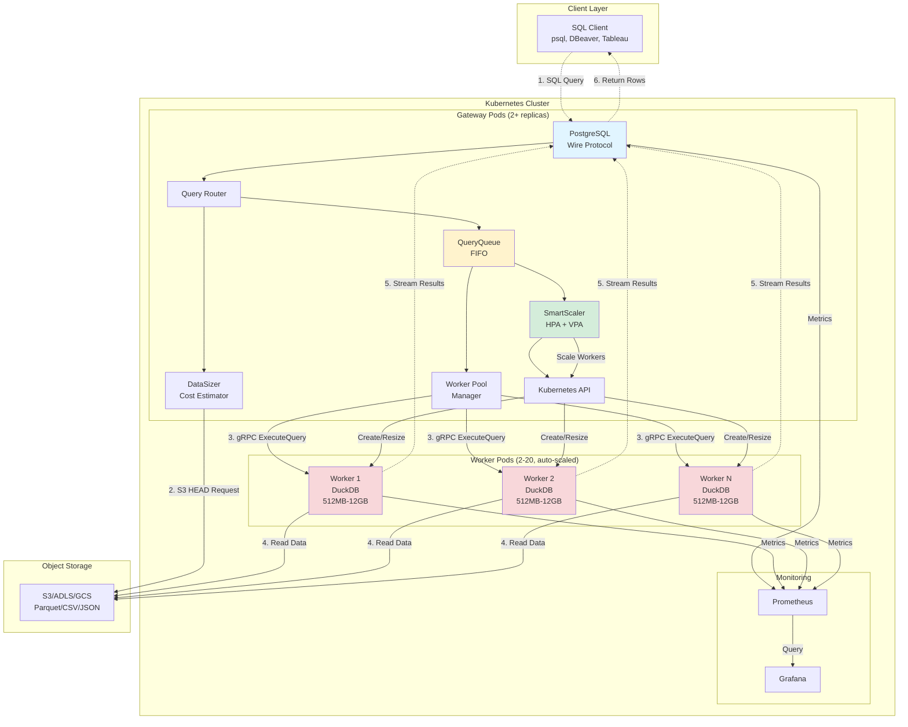

### Query Execution Sequence

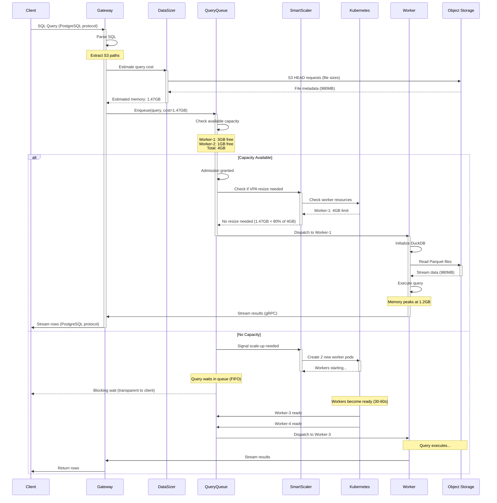

### QueryQueue Admission Control Flow

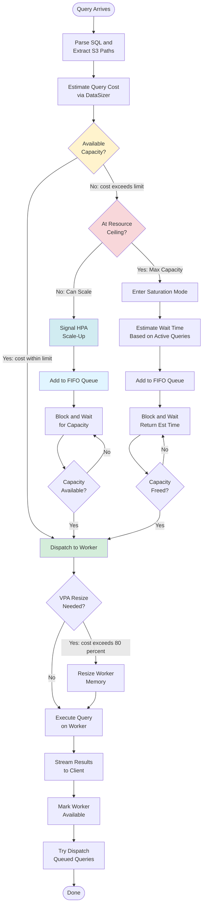

### HPA Scaling Decision Tree

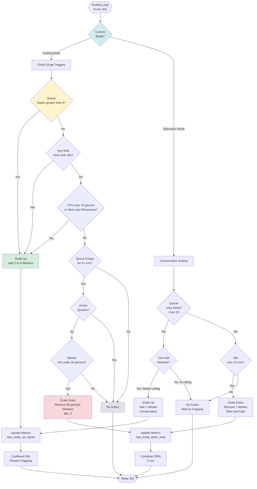

### VPA Resizing Decision Flow

```mermaid
flowchart TD
    Start([Query Dispatch]) --> EstCost[Estimated Cost<br/>from DataSizer]
    
    EstCost --> PreCheck{Pre-Assignment<br/>Check}
    
    PreCheck --> CalcNeeded[Calculate Needed Memory<br/>needed equals cost times 1.5]
    CalcNeeded --> GetCurrent[Get Worker Current Limit]
    GetCurrent --> Compare{needed greater than<br/>current times 0.8?}
    
    Compare -->|Yes| PreResize[Pre-Assignment Resize]
    PreResize --> CalcNew[Calculate new size<br/>max of needed and current]
    CalcNew --> CapNew{new greater than<br/>12GB max?}
    CapNew -->|new > 12GB| SetMax[Set to 12GB max]
    CapNew -->|new <= 12GB| SetNew[Set to new value]
    SetMax --> ApplyPre[Apply VPA Resize<br/>K8s API]
    SetNew --> ApplyPre
    ApplyPre --> WaitReady[Wait for Pod Ready<br/>10-30s]
    WaitReady --> Execute[Execute Query]
    
    Compare -->|No| Execute
    
    Execute --> Monitor[Monitor Execution]
    
    Monitor --> ElasticCheck{During Execution<br/>Memory Usage?}
    
    ElasticCheck --> CheckUtil{Util greater than<br/>80 percent limit?}
    CheckUtil -->|Yes| ElasticGrow[Elastic Growth<br/>new equals current times 1.5]
    ElasticGrow --> CapElastic{new greater than<br/>12GB max?}
    CapElastic -->|Yes| ElasticMax[Set to 12GB max]
    CapElastic -->|No| ElasticSet[Set to new value]
    ElasticMax --> ApplyElastic[Apply VPA Resize<br/>In-Place if K8s 1.27+]
    ElasticSet --> ApplyElastic
    ApplyElastic --> ContinueExec[Continue Execution]
    ContinueExec --> Complete
    
    CheckUtil -->|No| Complete[Query Completes]
    
    Complete --> FreeCheck[Mark Worker Available]
    FreeCheck --> IdleTimer[Start Idle Timer]
    IdleTimer --> IdleCheck{Idle for<br/>10+ min?}
    IdleCheck -->|No| WaitIdle[Wait...]
    WaitIdle --> IdleCheck
    IdleCheck -->|Yes| NoQueries{No active<br/>queries?}
    NoQueries -->|Yes| Shrink[Smart Shrink<br/>new equals 512MB min]
    NoQueries -->|No| NoShrink[No Shrink<br/>Keep Current]
    Shrink --> ApplyShrink[Apply VPA Resize]
    ApplyShrink --> End([Ready for Next Query])
    NoShrink --> End
    
    style PreResize fill:#d1ecf1
    style ElasticGrow fill:#fff3cd
    style Shrink fill:#f8d7da
    style Execute fill:#d4edda
```

### Resource Ceiling Detection

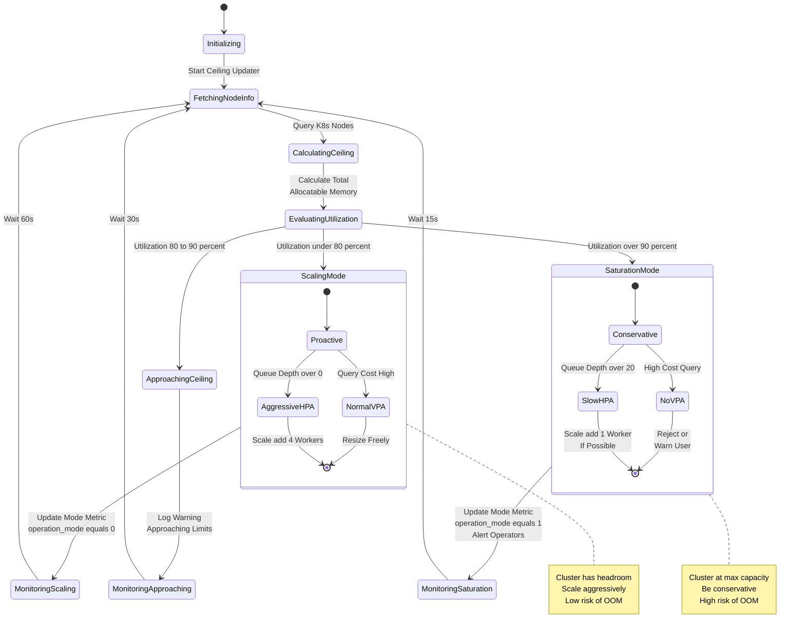

### Data Size Estimation Process

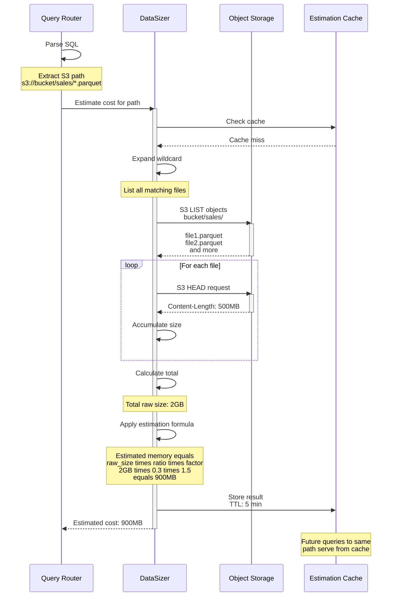

### Cost Estimation Formula

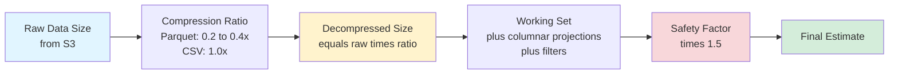

**Estimation Components:**

1. **Raw Size**: Sum of all file sizes from S3 (via HEAD requests)
2. **Compression Ratio**: 
   - Parquet: 0.2-0.4x (highly compressed)
   - CSV: 1.0x (uncompressed)
   - JSON: 0.8x
3. **Working Set Adjustment**:
   - `SELECT *`: Full decompressed size
   - Column projections: Proportion of selected columns
   - Filters: Estimated selectivity (conservative: assume 50%)
4. **Safety Factor**: 1.5x to account for:
   - Query intermediate results
   - DuckDB internal buffers
   - Hash tables for joins/aggregations
   - Sort buffers

**Example:**
```
Query: SELECT customer_id, amount FROM read_parquet('s3://bucket/*.parquet')
       WHERE date >= '2024-01-01'

Step 1: S3 HEAD requests
  - file1.parquet: 1GB
  - file2.parquet: 1GB
  - Total raw: 2GB

Step 2: Apply compression ratio (Parquet: 0.3x)
  - Decompressed: 2GB * 0.3 = 600MB

Step 3: Column projection (2 of 10 columns)
  - Selected data: 600MB * 0.2 = 120MB

Step 4: Filter selectivity (assume 50% of rows)
  - After filter: 120MB * 0.5 = 60MB

Step 5: Safety factor (1.5x)
  - Final estimate: 60MB * 1.5 = 90MB

Result: Assign worker with at least 90MB free memory
```

### Queue State Machine

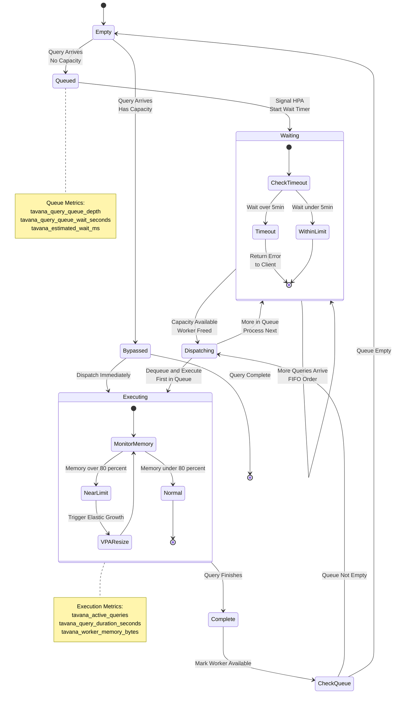

### Complete System State Transitions

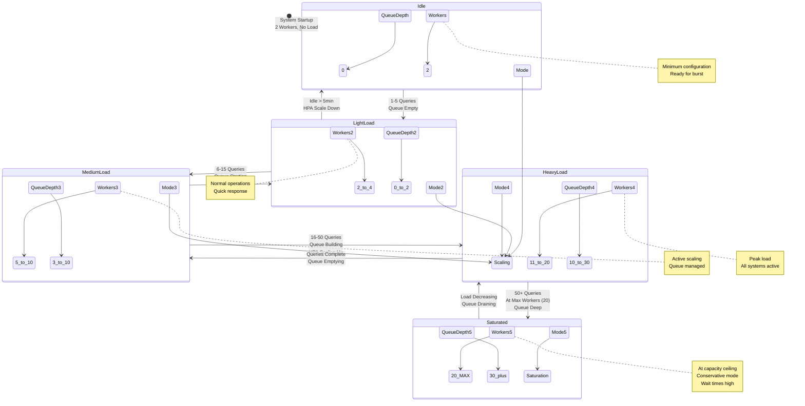

### Capacity Calculation Deep-Dive

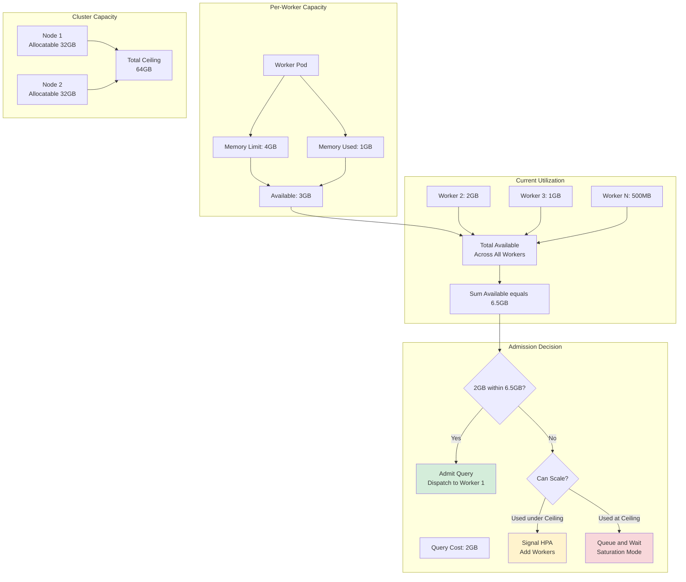

**Capacity Check Algorithm:**

```rust
// Simplified pseudocode
fn can_admit_query(query_cost_mb: u64) -> AdmissionDecision {
    // 1. Calculate total available capacity
    let available = workers.iter()
        .map(|w| w.memory_limit - w.memory_used)
        .sum();
    
    // 2. Check resource ceiling
    let used = workers.iter()
        .map(|w| w.memory_used)
        .sum();
    let ceiling = nodes.iter()
        .map(|n| n.allocatable_memory)
        .sum();
    let utilization = used as f64 / ceiling as f64;
    
    // 3. Make admission decision
    if query_cost_mb <= available {
        // Direct admission
        return Admit;
    } else if utilization < 0.80 {
        // Can scale up
        signal_hpa_scale_up();
        return QueueAndWait;
    } else {
        // At ceiling, saturation mode
        set_operation_mode(Saturation);
        return QueueAndWait;
    }
}
```

---

## 🗺️ Roadmap

### v1.0.x (Current)
- [x] True streaming server-side cursors (O(n) FETCH performance)
- [x] Delta Lake support with Azure Workload Identity
- [x] Automatic Azure token refresh for long-running sessions
- [x] Tableau Desktop compatibility

### v1.1 (Q1 2025)
- [ ] AWS EKS Terraform module
- [ ] Query result caching (Redis)
- [ ] Enhanced monitoring (distributed tracing with OpenTelemetry)

### v1.2 (Q2 2025)
- [ ] GCP GKE Terraform module
- [ ] Multi-tenancy (namespace isolation)
- [ ] Query optimizer (cost-based query planning)

### v2.0 (Q3 2025)
- [ ] Catalog integration (Unity Catalog, Apache Iceberg)
- [ ] Query scheduling (cron jobs, event-driven)
- [ ] Data lineage tracking

---

## 📁 Project Structure

```
tavana/
├── .github/
│   └── workflows/           # CI/CD pipelines
│       ├── ci.yaml         # Build, test, lint
│       ├── release.yaml    # Multi-arch Docker builds, Helm publishing
│       └── security.yaml   # Trivy scanning, cargo audit
│
├── crates/
│   ├── tavana-gateway/     # Gateway service (Rust)
│   │   ├── src/
│   │   │   ├── main.rs            # Entry point
│   │   │   ├── pg_wire.rs         # PostgreSQL wire protocol
│   │   │   ├── cursors.rs         # Server-side cursor support (DECLARE/FETCH/CLOSE)
│   │   │   ├── worker_client.rs   # gRPC client for workers (query + cursor APIs)
│   │   │   ├── query_queue.rs     # FIFO queue with capacity awareness
│   │   │   ├── smart_scaler.rs    # HPA + VPA logic
│   │   │   ├── worker_pool.rs     # Worker discovery & load balancing
│   │   │   ├── data_sizer.rs      # Query cost estimation
│   │   │   └── metrics.rs         # Prometheus metrics
│   │   └── Cargo.toml
│   │
│   ├── tavana-worker/      # Worker service (Rust)
│   │   ├── src/
│   │   │   ├── main.rs            # Entry point
│   │   │   ├── executor.rs        # DuckDB query execution
│   │   │   ├── cursor_manager.rs  # Server-side cursor state (Arrow iterators)
│   │   │   ├── grpc.rs            # gRPC service (ExecuteQuery, DeclareCursor, etc.)
│   │   │   └── streaming.rs       # Result streaming
│   │   └── Cargo.toml
│   │
│   └── tavana-common/      # Shared library
│       ├── src/
│       │   ├── proto/             # gRPC protobuf definitions
│       │   ├── auth.rs            # Authentication helpers
│       │   └── config.rs          # Configuration management
│       └── Cargo.toml
│
├── terraform/
│   └── azure/              # Azure infrastructure module
│       ├── main.tf                # AKS cluster, ACR, ADLS Gen2
│       ├── variables.tf
│       ├── outputs.tf
│       └── examples/
│           ├── quickstart/        # Minimal setup
│           └── enterprise/        # Production-grade with HA
│
├── helm/
│   └── tavana/             # Helm chart
│       ├── Chart.yaml
│       ├── values.yaml            # Default values
│       ├── values-azure.yaml      # Azure-specific overrides
│       └── templates/
│           ├── gateway-deployment.yaml
│           ├── worker-deployment.yaml
│           ├── hpa.yaml           # Horizontal Pod Autoscaler
│           ├── rbac.yaml          # ServiceAccount, Role, RoleBinding
│           ├── networkpolicy.yaml
│           └── ingress.yaml
│
├── gitops-template/        # Customer GitOps repository template
│   ├── apps/
│   │   └── tavana.yaml            # ArgoCD Application
│   └── values/
│       └── overrides.yaml         # Customer-specific overrides
│
├── deploy.sh               # One-click deployment script
├── Dockerfile.gateway      # Multi-stage build for Gateway
├── Dockerfile.worker       # Multi-stage build for Worker (with DuckDB extensions)
├── README.md               # This file
└── docs/                   # Documentation
    └── CUSTOMER-DEPLOYMENT-GUIDE.md  # Step-by-step deployment
```

---

## 🔧 Configuration

### Environment Variables

#### Gateway
| Variable | Description | Default |
|----------|-------------|---------|
| `RUST_LOG` | Log level (trace/debug/info/warn/error) | `info` |
| `PG_PORT` | PostgreSQL wire protocol port | `5432` |
| `HTTP_PORT` | Health check & metrics port | `8080` |
| `WORKER_SERVICE_NAME` | Kubernetes worker service name | `worker` |
| `WORKER_SERVICE_PORT` | Worker gRPC port | `50053` |
| `MAX_WORKERS` | Maximum worker pods (HPA limit) | `20` |
| `MIN_WORKERS` | Minimum worker pods (HPA limit) | `2` |
| `QUEUE_TIMEOUT_MS` | Max time query can wait in queue | `300000` (5 min) |
| `TLS_ENABLED` | Enable TLS/SSL for PostgreSQL connections | `false` |
| `TAVANA_TLS_ENABLED` | Same as TLS_ENABLED (env var used internally) | `false` |
| `TAVANA_TLS_CERT_PATH` | Path to TLS certificate (PEM format) | - |
| `TAVANA_TLS_KEY_PATH` | Path to TLS private key (PEM format) | - |
| `TAVANA_TLS_SELF_SIGNED` | Generate self-signed certificate | `true` |
| `TAVANA_TLS_COMMON_NAME` | Common name for self-signed cert | `tavana.local` |

#### Worker
| Variable | Description | Default |
|----------|-------------|---------|
| `RUST_LOG` | Log level | `info` |
| `GRPC_PORT` | gRPC server port | `50053` |
| `S3_ENDPOINT` | S3-compatible endpoint (optional) | Auto-detected |
| `S3_BUCKET` | Default S3 bucket (optional) | - |
| `AWS_REGION` | AWS region | `us-east-1` |
| `DUCKDB_EXTENSIONS_DIR` | DuckDB extensions path | `/home/tavana/.duckdb/extensions` |

### Helm Values

See [helm/tavana/values.yaml](./helm/tavana/values.yaml) for all options.

**Key Configurations:**

```yaml
gateway:
  replicaCount: 2                    # High availability
  resources:
    requests:
      memory: "1Gi"
      cpu: "500m"
    limits:
      memory: "4Gi"
      cpu: "2000m"

worker:
  replicaCount: 2                    # Initial worker count
  minReplicas: 1                     # HPA minimum
  maxReplicas: 20                    # HPA maximum
  resources:
    requests:
      memory: "2Gi"
      cpu: "500m"
    limits:
      memory: "12Gi"                 # Max VPA can resize to
      cpu: "3500m"

hpa:
  enabled: true
  targetCPUUtilizationPercentage: 70
  targetMemoryUtilizationPercentage: 80

# TLS/SSL configuration
gateway:
  tls:
    enabled: true                       # Enable SSL support
    selfSigned: true                    # Use self-signed cert (dev)
    commonName: "tavana.example.com"    # CN for self-signed
    existingSecret: ""                  # Use existing K8s secret
    existingSecretCertKey: "tls.crt"    # Cert key in secret
    existingSecretKeyKey: "tls.key"     # Private key in secret

objectStorage:
  endpoint: ""                       # e.g., s3.amazonaws.com or minio.local:9000
  bucket: ""                         # Default bucket
  region: "us-east-1"
  pathStyle: false                   # true for MinIO/ADLS
```

---

## 📚 Additional Documentation

- [Customer Deployment Guide](./docs/CUSTOMER-DEPLOYMENT-GUIDE.md) - Step-by-step deployment for all scenarios
- [Helm Chart Documentation](./helm/tavana/README.md) - Helm chart reference
- [Terraform Modules](./terraform/README.md) - Infrastructure as Code reference
- [GitOps Template](./gitops-template/README.md) - ArgoCD setup guide

---

## 🤝 Contributing

We welcome contributions! Please:

1. Fork the repository
2. Create a feature branch (`git checkout -b feature/amazing-feature`)
3. Commit your changes (`git commit -m 'Add amazing feature'`)
4. Push to the branch (`git push origin feature/amazing-feature`)
5. Open a Pull Request

### Development Setup

```bash
# Install Rust
curl --proto '=https' --tlsv1.2 -sSf https://sh.rustup.rs | sh

# Install protoc
# macOS:
brew install protobuf

# Ubuntu/Debian:
sudo apt-get install -y protobuf-compiler libprotobuf-dev

# Clone repository
git clone https://github.com/Angelerator/Tavana.git
cd Tavana

# Build
cargo build

# Run tests
cargo test --all

# Run locally (requires Kubernetes)
cargo run --bin tavana-gateway
```

---

## 📄 License

Apache License 2.0 - see [LICENSE](./LICENSE) file for details.

---

## 🙏 Acknowledgments

- **DuckDB** - The world's fastest OLAP database engine
- **Kubernetes** - Container orchestration platform
- **Rust** - Systems programming language for safety and performance
- **PostgreSQL** - For the wire protocol specification

---

## 📞 Support

- **Issues**: https://github.com/Angelerator/Tavana/issues
- **Discussions**: https://github.com/Angelerator/Tavana/discussions
- **Documentation**: https://github.com/Angelerator/Tavana/tree/main/docs

---

**Built with ❤️ in Rust**
