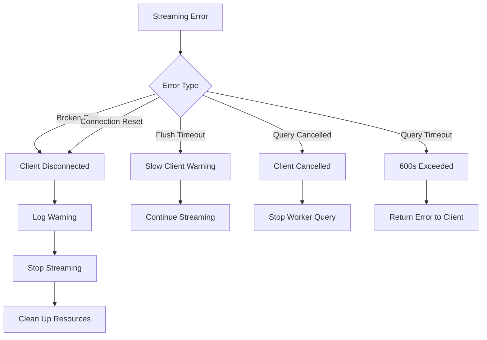

# Tavana Query Execution Flow - End-to-End Sequence Diagram

This document describes the complete data flow when a client executes a query through Tavana.

## High-Level Architecture

```
┌─────────┐     PostgreSQL      ┌─────────┐       gRPC        ┌─────────┐
│  Client │ ◄──── Wire ────────► │ Gateway │ ◄───────────────► │ Worker  │
│(DBeaver)│     Protocol        │(pg_wire)│    Streaming     │ (DuckDB)│
└─────────┘                     └─────────┘                   └─────────┘
```

## Detailed Sequence Diagram

```mermaid
sequenceDiagram
    autonumber
    participant C as Client<br/>(DBeaver/Tableau)
    participant TCP as TCP Socket<br/>(TLS optional)
    participant PG as pg_wire.rs<br/>(Gateway)
    participant QR as QueryRouter
    participant WC as WorkerClient
    participant gRPC as gRPC Channel<br/>(mpsc:32)
    participant GS as grpc.rs<br/>(Worker Service)
    participant CH as mpsc Channel<br/>(buffer: 64)
    participant EX as executor.rs<br/>(DuckDB)
    participant DUCK as DuckDB<br/>(delta_scan)
    participant AZ as Azure Storage<br/>(Parquet files)

    %% === CONNECTION PHASE ===
    rect rgb(240, 248, 255)
        Note over C,PG: Connection & Authentication
        C->>TCP: TCP Connect (port 5432)
        TCP->>PG: accept()
        PG->>PG: configure_tcp_keepalive(10s)
        
        alt SSL Negotiation
            C->>PG: SSLRequest
            PG->>C: 'S' (SSL accepted)
            C->>TCP: TLS Handshake
            TCP->>PG: TLS Stream established
        end
        
        C->>PG: StartupMessage(user, database)
        PG->>PG: AuthService.authenticate()
        PG->>C: AuthenticationOk
        PG->>C: ParameterStatus (server_version, etc.)
        PG->>C: ReadyForQuery('I' = Idle)
    end

    %% === QUERY PHASE ===
    rect rgb(255, 250, 240)
        Note over C,PG: Simple Query Protocol
        C->>PG: Query('SELECT * FROM delta_scan(...)')
        PG->>PG: info!("Simple Query message received")
        PG->>PG: Parse SQL, extract query text
        PG->>PG: get_transaction_state_change()
    end

    %% === ROUTING PHASE ===
    rect rgb(240, 255, 240)
        Note over PG,WC: Query Routing
        PG->>QR: route_query(sql)
        QR->>QR: Estimate data size (200MB)
        QR->>QR: Calculate memory need (390MB)
        
        alt SmartScaler Available
            QR->>QR: Try get_idle_worker()
            QR-->>PG: PreSized(worker_addr)
        else Fallback to Pool
            QR-->>PG: WorkerPool
        end
    end

    %% === WORKER EXECUTION PHASE ===
    rect rgb(255, 240, 245)
        Note over WC,DUCK: Worker Query Execution
        PG->>WC: execute_query_streaming(sql, user_id)
        WC->>WC: Create mpsc channel(32)
        WC->>gRPC: ExecuteQueryRequest
        gRPC->>GS: execute_query(request)
        
        GS->>GS: info!("Executing query with TRUE STREAMING")
        GS->>GS: register_query(query_id)
        GS->>GS: Create mpsc channel(64)
        
        GS->>EX: spawn_blocking { execute_query_streaming }
        
        Note over EX,AZ: DuckDB Query Execution
        EX->>DUCK: conn.prepare(sql)
        EX->>DUCK: stmt.query_arrow()
        
        loop For each Parquet file
            DUCK->>AZ: HTTP GET (8 threads parallel)
            AZ-->>DUCK: Parquet data chunks
            DUCK->>DUCK: Decode Arrow batches
        end
    end

    %% === STREAMING PHASE ===
    rect rgb(240, 255, 255)
        Note over DUCK,C: True Streaming (Row by Row)
        
        loop For each RecordBatch (2048 rows)
            DUCK-->>EX: RecordBatch
            
            alt First Batch
                EX->>EX: info!("First batch received", first_batch_ms)
                EX->>EX: Extract schema (columns, types)
                EX->>CH: send(QueryMetadata)
                CH-->>GS: QueryMetadata
                GS-->>gRPC: QueryResultBatch::Metadata
                gRPC-->>WC: StreamingBatch::Metadata
                WC-->>PG: Metadata { columns, types }
                PG->>TCP: RowDescription message
                TCP->>C: 'T' + column info
            end
            
            EX->>EX: serialize_batch_to_json(batch)
            EX->>CH: send(ArrowRecordBatch)
            CH-->>GS: ArrowRecordBatch
            GS-->>gRPC: QueryResultBatch::RecordBatch
            gRPC-->>WC: StreamingBatch::Rows(Vec<Vec<String>>)
            
            loop For each row in batch
                WC-->>PG: row: Vec<String>
                PG->>PG: send_data_row(socket, row)
                PG->>TCP: DataRow message
                Note right of TCP: 'D' + len + col_count + values
                TCP->>C: DataRow bytes
                
                PG->>PG: total_rows += 1
                PG->>PG: batch_rows += 1
                
                alt batch_rows >= 100 (STREAMING_BATCH_SIZE)
                    PG->>TCP: socket.flush() with 30s timeout
                    TCP->>C: TCP send buffer flush
                    
                    alt Flush timeout or BrokenPipe
                        PG->>PG: warn!("Client disconnected")
                        PG--xC: Connection closed
                    end
                    
                    PG->>PG: batch_rows = 0
                end
                
                alt total_rows % 1000 == 0
                    PG->>TCP: is_client_connected() check
                    alt Client disconnected
                        PG->>PG: warn!("Client disconnected")
                        PG--xC: Stop streaming
                    end
                end
            end
            
            alt Progress logging (every 10s)
                EX->>EX: info!("Streaming progress", rows, elapsed)
            end
        end
    end

    %% === COMPLETION PHASE ===
    rect rgb(255, 255, 240)
        Note over EX,C: Query Completion
        EX->>EX: info!("Query completed: N rows in Xs")
        EX->>CH: send(QueryProfile)
        CH-->>GS: QueryProfile
        GS->>GS: active_queries.remove(query_id)
        GS-->>gRPC: QueryResultBatch::Profile
        gRPC-->>WC: (stream ends)
        WC-->>PG: (stream ends)
        
        PG->>TCP: CommandComplete('SELECT N')
        Note right of TCP: 'C' + len + "SELECT 1234567"
        TCP->>C: CommandComplete bytes
        
        alt total_rows > 100000
            PG->>PG: warn!("Large result set, recommend LIMIT/CURSOR")
        end
        
        PG->>PG: Update transaction_status
        PG->>TCP: ReadyForQuery(status)
        Note right of TCP: 'Z' + len + 'I'/'T'/'E'
        TCP->>C: ReadyForQuery bytes
        
        PG->>PG: info!("Query completed (TLS streaming)", rows, exec_ms)
    end
```



## Key Components and Their Roles

### 1. pg_wire.rs (Gateway)
- **Purpose**: PostgreSQL wire protocol implementation
- **Key Functions**:
  - `run_query_loop_generic()`: Main query loop for TLS connections
  - `execute_query_streaming_default_impl()`: Streaming execution
  - `send_data_row()`: Send individual DataRow messages
  - `send_row_description()`: Send column metadata

### 2. worker_client.rs (Gateway)
- **Purpose**: gRPC client for worker communication
- **Key Functions**:
  - `execute_query_streaming()`: Start streaming query
  - Creates `mpsc::channel(32)` for result streaming
  - Spawns async task to read gRPC stream

### 3. grpc.rs (Worker)
- **Purpose**: gRPC service implementation
- **Key Functions**:
  - `execute_query()`: Entry point for queries
  - Creates `mpsc::channel(64)` for batch streaming
  - Uses `spawn_blocking` for DuckDB execution

### 4. executor.rs (Worker)
- **Purpose**: DuckDB query execution
- **Key Functions**:
  - `execute_query_streaming()`: Stream batches via callback
  - 8 threads for parallel Azure I/O
  - JSON serialization for Arrow batches

## Backpressure Points

```
┌────────────────────────────────────────────────────────────────────────────┐
│                          BACKPRESSURE FLOW                                  │
├────────────────────────────────────────────────────────────────────────────┤
│                                                                            │
│  DuckDB ──► [batch callback] ──► mpsc(64) ──► gRPC ──► mpsc(32) ──► flush  │
│                                                                            │
│  If mpsc(32) full:                                                         │
│    └─► WorkerClient blocks on recv                                         │
│    └─► gRPC stream blocks                                                  │
│    └─► mpsc(64) fills up                                                   │
│    └─► batch callback blocks on send                                       │
│    └─► DuckDB pauses (natural backpressure)                                │
│                                                                            │
│  If TCP buffer full (client slow):                                         │
│    └─► socket.flush() blocks                                               │
│    └─► Gateway pauses reading from mpsc(32)                                │
│    └─► Backpressure propagates to DuckDB                                   │
│                                                                            │
└────────────────────────────────────────────────────────────────────────────┘
```

## Configuration Parameters

| Parameter | Default | Description |
|-----------|---------|-------------|
| `STREAMING_BATCH_SIZE` | 100 rows | Rows before socket flush |
| `query_timeout_secs` | 600s | Max query duration |
| `tcp_keepalive_secs` | 10s | TCP keepalive interval |
| `connection_check_interval` | 1000 rows | Client health check interval |
| `mpsc channel (worker)` | 64 | Batch buffer on worker |
| `mpsc channel (gateway)` | 32 | Batch buffer on gateway |
| `DuckDB threads` | 8 | Parallel I/O threads |

## Error Handling



## Client-Side Issues

The server streams correctly, but clients may crash because:

1. **JDBC Driver Buffering**: PostgreSQL JDBC buffers all rows before returning
2. **Client Memory**: 1M rows × 1KB = 1GB client memory
3. **Solution**: Use `LIMIT/OFFSET` or `DECLARE CURSOR/FETCH`

```sql
-- Recommended for large datasets:
DECLARE c CURSOR FOR SELECT * FROM delta_scan('...');
FETCH 5000 FROM c;
-- repeat as needed
CLOSE c;
```
